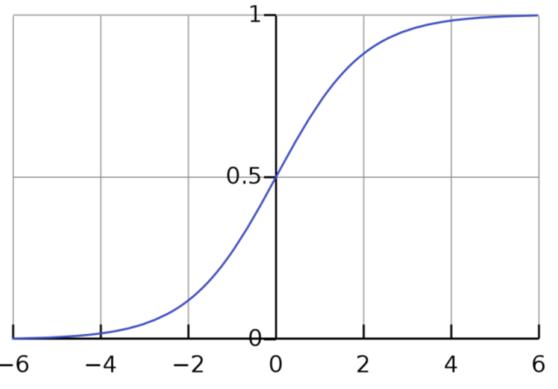
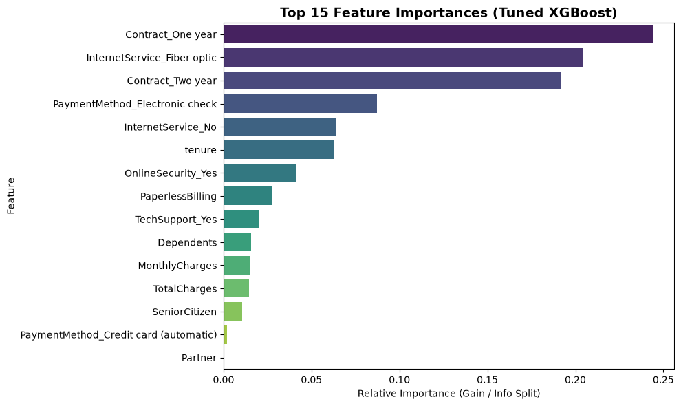
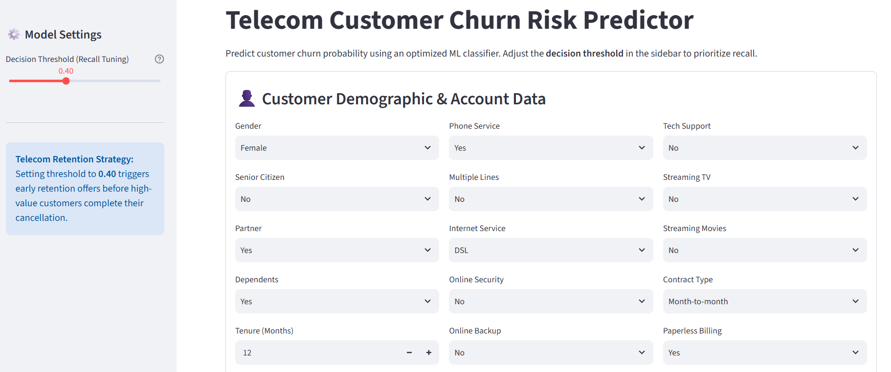
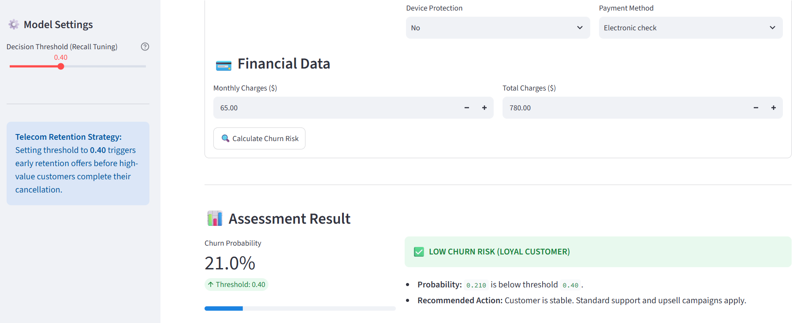

# 📰 IBM Churn Prediction
### Comparison of Different Classification Models

## 📑 Table of Contents

- [About The Project](#-about-the-project)
- [Dependencies](#-dependencies)
- [Dataset](#-dataset)
- [Data Preprocessing Pipeline](#-data-preprocessing-pipeline)
- [Model Architectures](#-model-architectures)
- [Insights](#-insights)
- [Results & Performance Comparison](#-results--performance-comparison)
- [Streamlit Deployment](#-streamlit-deployment)
- [Installation & Setup](#-installation--setup)
- [Author](#-author)
- [License](#-license)

## 📌 About The Project

This project implements a binary classification system on churn dataset of IBM company using classification models in scikit-learn library.

The primary objectives are:

- Cleaning data and performing EDA
- Comparing logistic regression, random forest and XGBoost model outcomes based on the best tradeoff between recall and precision
- Model tuning using GridSearchCV
- Web Application deployment of the model using streamlit library


## 🗂 Dependencies


The complete list of all requirements is available in requirements.txt file

## 📊 Dataset 
 
The dataset used in this project is Telco Customer Churn dataset collected from the following kaggle dataset:

- **Source:** [Telco Churn](https://www.kaggle.com/datasets/blastchar/telco-customer-churn)

All credit for the dataset belongs to the original authors/providers. This repository uses the dataset for educational and research purposes only.

This dataset consists of numerous features for customers in IBM company and their churn state. There are a total of 7043 entries and 20 attributes. Some attributes are mentioned below:

- gender
- Depenedents
- tenure
- Contract
- Payment Method

## 🔎 Data Preprocessing Pipeline

### 1️⃣ Basic EDA

- checking target distribution and overall state of the dataset
- Dropping the "customerID" column
- checking empty columns

### 2️⃣ Feature Engineering
Due to the fact that this dataset has many categorical features, finding the best features for training process is done in multiple steps:

- correlation between numerical features and target in examined at first
- after examination of categorical features, the ones having weaker linaer relationship with target are dropped based on chi2-square test and Cramer's V. 
- In the end, for a complete understanding of the best features mutual information method is used to detect all types of relationships between features

### 3️⃣ Main Preprocessing 

The following transformations are done in this section:

- Filling missing values
- encoding categorical features
- Scaling numerical features

Spiltting the dataset into train and test parts was necessary for the mutual information process and is done in the last section.

## 🧠 Model Architectures

Three architectures are examined for this project:

- Logistic Regression
- Random Forest
- XGBoost

The proposed models are suitable for binary classification in this project.

### 🔹 Logistic Regression
Logistic regression model is especially used to estimate the probability that the instance belongs to a class. If the estimated probability is greater than 50%, then the model predicts that the instance belongs to that class (positive class, labeled “1”), or else it predicts that it does not (negative class, labeled “0”). This makes it a binary classifier suitable for this project and the first model that is examined.

<p align="center">
  
</p>

<p align="center">
  <em>1. Logistic Regression</em>
</p>

### 🔹 Random Forest
Random Forest is an ensemble machine learning algorithm that builds multiple decision trees and combines their predictions to improve accuracy and reduce overfitting. This method is used for classification in this project because it handles large datasets and nonlinear relationships well.

This Classifier also provides insight into which features were the most important in making predictions which is called feature importance and can be used for feature engineering verification.

<p align="center">
  
</p>

<p align="center">
  <em>2. Random Forest</em>
</p>

### 🔹 XGBoost
XGBoost (eXtreme Gradient Boosting) is a distributed, open-source machine learning library that uses gradient boosted decision trees, a supervised learning boosting algorithm that makes use of gradient descent. It is known for its speed, efficiency and ability to scale well with large datasets. This powerful model is also used in this project as one of the classification candidates. 

## ✔️ Insights
After training all three models and obtaining the test results it is considered that all three model despite their difference in performance and ability have appoximately similar results. Evaluation Metrics in the table below are mentioned for class 1 (Churn). 

| Model  | Accuracy | Precision | Recall | F1-score |
|---------------|-----------------|----|------|--------|
| Logistic Regression |0.737|0.50|0.80|0.62|
| Random Forest  |0.747|0.51|0.80|0.63|
| XGBoost     |0.803|0.66|0.53|0.59|

In order to achieve better results fine-tuning is done on some parameters in the next section.


###  Threshold Tuning 
All of these three models return the probability of churn. Based on the threshold they have, probabilites get mapped to a class: 

- if the probability is *less* than threshold class 0 in predicted
- if the probability is *more than or equal* threshold class 1 in predicted

the value of threshold by default is 0.5. 

<p align="center">
  
</p>

<p align="center">
  <em>3. Threshold Tuning</em>
</p>

Main purpose of this project is to predict as many churners as possible, in order to achieve this goal metric **recall** should be in its greater value. By lowering the threshold, recall will be increase but precision will decrease as well.

| Threshold | Accuracy | Precision | Recall | F1-score |
|-----|-------|------|------|------|
| 0.3 | 0.646 | 0.42 | 0.92 | 0.58 |
| 0.4 | 0.699 | 0.46 | 0.86 | 0.60 |
| 0.5 | 0.737 | 0.50 | 0.80 | 0.62 |
| 0.6 | 0.764 | 0.54 | 0.72 | 0.62 |

While changing the threshold the state where f1-score and recall metrics are balanced is chosen which is:
***threshold=0.4***

It is considered that this threshold was chosen by tuning on logisitc regression model and the rest of the calculations for all models are done using this this threshold value.

### Hyperparameter Tuning
Hyperparamter tuning in this section is performed using `GridSearchCV` in scikit-learn library. This tool finds the best combination of paramters that results in the highest model performance based on the metric that is chosen. 

> Performance metric for all models during gridsearch is **F1-macro** which is the average of F1-score for both target classes and is used when target classes are *imbalanced*.


## 📈 Results & Performance Comparison
After hyperparameter tuning a dataframe is created to compare the final results.

| Tuned Model | Accuracy | Precision | Recall | F1-score |
|---------------------|-------|------|------|------|
| Logistic Regression | 0.776 | 0.56 | 0.66 | 0.61 |
| Random Forest       | 0.731 | 0.50 | 0.83 | 0.62 |
| XGBoost             | 0.789 | 0.59 | 0.65 | 0.62 |

Considering the balance between all the features, the winner model is chosen to be:
***Tuned XGBoost***

Feature importance for tuned xgboost model is shown below. 
<p align="center">
  
</p>

<p align="center">
  <em>4. Tuned XGBoost Feature Importance Plot</em>
</p>

## 📲 Streamlit Deployment

This project includes an interactive Streamlit application for churn prediction. User inputs are transformed with `get_dummies()` to match the training workflow, then aligned with the saved feature schema before inference. 
Numerical features are scaled using the saved scaler, and the trained model returns both churn probability and the final prediction based on the selected threshold. This setup makes the app consistent with the training pipeline and suitable for quick testing of new customer profiles.

<p align="center">
  
</p>

<p align="center">
  <em>5. Streamlit App : input features Overview</em>
</p>

<p align="center">
  
</p>

<p align="center">
  <em>6. Streamlit App : results Overview</em>
</p>

## 💻 Installation & Setup

### 1️⃣ Clone Repository

bash
git clone https://github.com/Yasaman-Khouri/Churn_IBM
cd bbc-sport-classifier

### 2️⃣ Create Virtual Environment

```bash
python -m venv venv
source venv/bin/activate   # Linux/Mac
venv\Scripts\activate      # Windows
```

### 3️⃣ Install Dependencies

```bash
pip install -r requirements.txt
```

## 👤 Author
### **Yasaman Khouri**   

### GitHub: https://github.com/Yasaman-Khouri 

### Email : jsmnkhouri@gmail.com

## 📃 License

This project code is licensed under the MIT License.

**The dataset used in this project belongs to its original providers and is subject to its own license and usage terms.**


